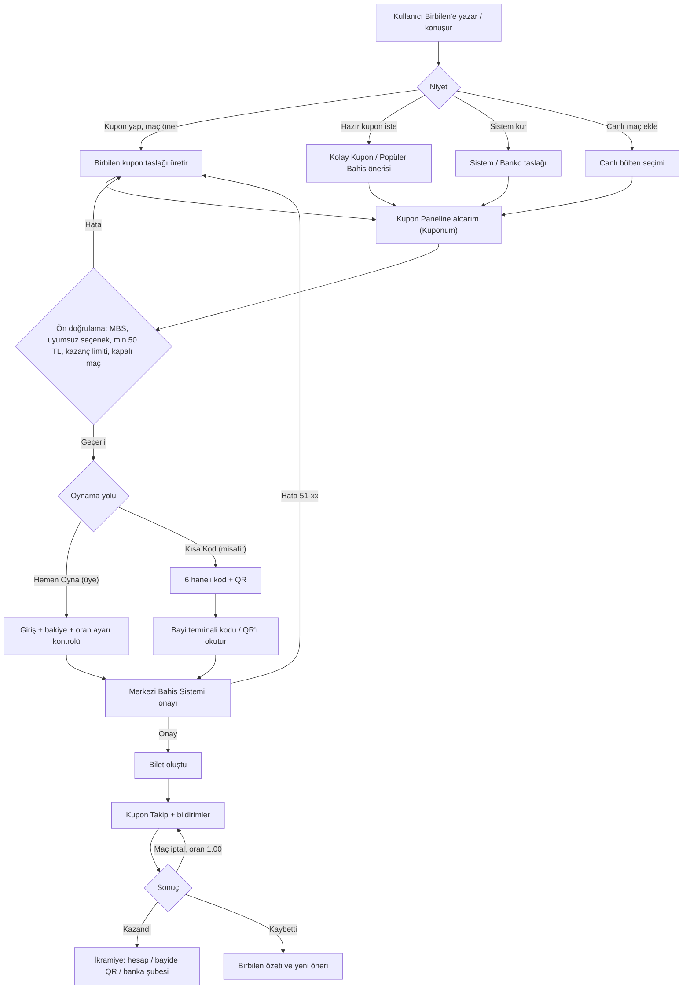
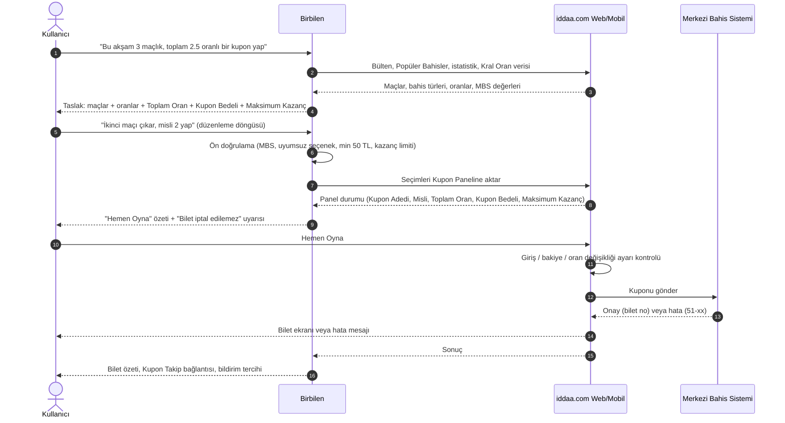
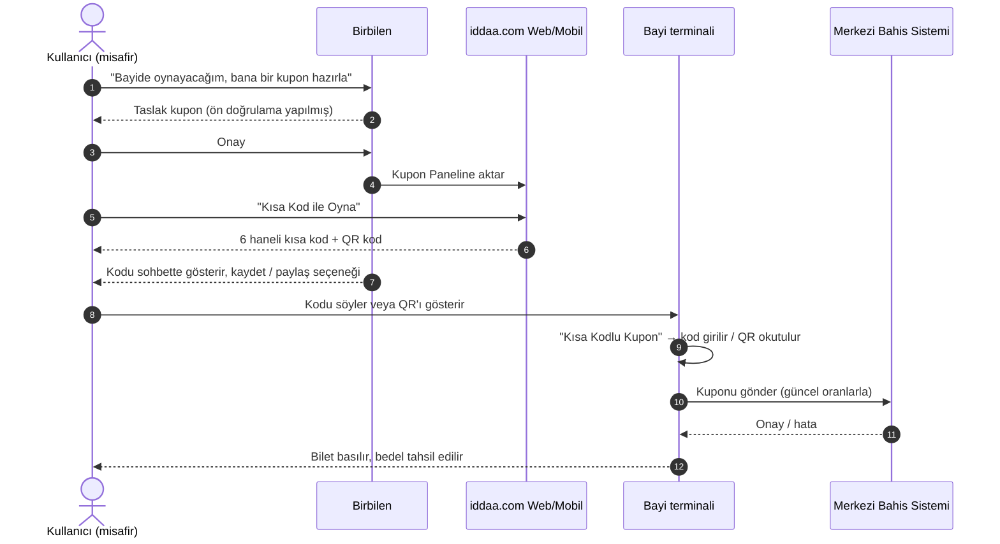
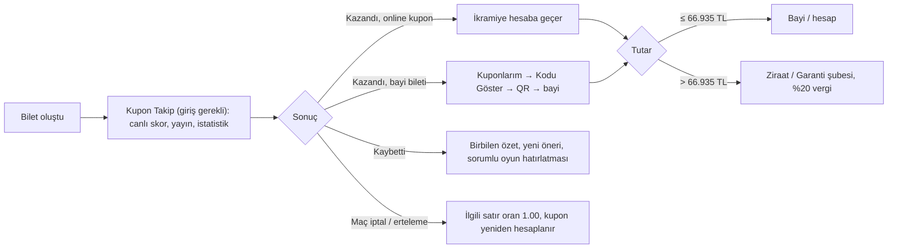
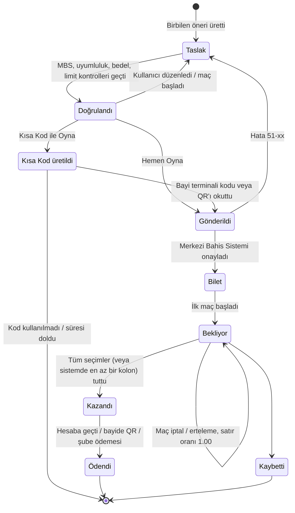

# Birbilen ile Kupon Oynama Akışları

> **Durum:** Taslak v0.1 · **Tarih:** 2026-09-16 · **Kapsam:** iddaa.com web + mobil uygulama

Bu belge, **Birbilen** (yapay zekâ destekli kupon asistanı) üzerinden iddaa.com'da bir kuponun
**oluşturulmasından ikramiyenin alınmasına kadar** geçen uçtan uca akışları; iş kurallarını,
istisna/hata yollarını, kupon yaşam döngüsünü ve E2E test senaryo kırılımını tanımlar.

## 0. Varsayımlar ve kaynaklar

| # | Varsayım / Not |
|---|---|
| V1 | Erişilebilen depolarda (`sondepremler-api`, `iddaa-e2e`, `e2etest.dev`, `iddaa-desktop`, `sanstech`) ve iddaa.com / mobil uygulama mağaza sayfalarında "Birbilen" adına ait kod, doküman ya da ürün bilgisi **bulunamadı**. Bu belge Birbilen'i **iddaa.com web ve mobil uygulamasının içinde çalışan, sohbet tabanlı bir kupon asistanı** olarak modeller. |
| V2 | Birbilen **bahis kabul etmez, ödeme almaz, bilet üretmez.** Kupon taslağı üretir, doğrular ve iddaa.com'un mevcut **Kupon Paneli**'ne aktarır; bahis her zaman iddaa.com → Spor Toto **Merkezi Bahis Sistemi** üzerinden oynanır. Son onay daima kullanıcıdadır. |
| V3 | Kurallar iddaa.com Yardım Merkezi ve Spor Toto "Sabit İhtimalli Bahis Oyunları (İddaa) Oyun Planı" belgesinden alınmıştır (bkz. Kaynaklar). "Doğrulanmadı" notu düşülen değerler üçüncü taraf kaynaklıdır. |
| V4 | Bu belgede **MBS** kısaltması iddaa.com'daki anlamıyla *Minimum Bahis Sayısı*'dır. Spor Toto'nun merkezi sistemi için her yerde açık adı *Merkezi Bahis Sistemi* kullanılır. |

## 1. Aktörler ve sistemler

| Aktör / Sistem | Rolü |
|---|---|
| **Misafir kullanıcı** | Giriş yapmadan kupon hazırlar; yalnızca **Kısa Kod / QR** ile bayide oynayabilir. |
| **Üye** | 18+ T.C. vatandaşı, SMS ile doğrulanmış, bayi seçmiş ve bakiye yüklemiş hesap; **Hemen Oyna** ile online oynar. |
| **Birbilen** | Sohbet asistanı. Niyet anlar, bülten/Popüler Bahis/istatistik verisiyle kupon taslağı üretir, kuralları önden doğrular, kupon paneline aktarır, sonuç ve takip bilgisini özetler. |
| **iddaa.com Web / Mobil** | Bülten (Program), Kupon Paneli ("Kuponum"), Kolay Kuponlar, Kupon Takip, Üyelik, Para Yatır/Çek ekranları. |
| **Merkezi Bahis Sistemi (Spor Toto)** | Kuponu kabul/ret eder, bilet numarası üretir, sonuçları ve ikramiyeyi belirler, limitleri uygular. |
| **Risk Yönetim Merkezi** | Oranları belirler ve değiştirir, bahisleri kapatır/açar, limit koyar. |
| **Bayi terminali** | Kısa Kod / QR ile kuponu oynatır, bileti basar, QR ile ikramiye öder. |

## 2. İş kuralları ve ön koşullar

| Kural | Değer / Davranış | Kaynak |
|---|---|---|
| Yaş ve uyruk | 18 yaşını doldurmuş T.C. vatandaşı oynayabilir. | Yardım: *Kimler iddaa oynayabilir?*; Oyun Planı md. 6 |
| Üyelik | TC kimlik no, ad, soyad, doğum tarihi, meslek, cep telefonu (10 hane), şifre, **bayi seçimi**. SMS doğrulama kodu; üye numarası SMS ile gelir; **3 gün içinde bakiye yüklenmeli**. | Yardım: *Nasıl Üye Olurum?* |
| Bayi seçimi | Yasal zorunluluk; konuma göre en yakın bayi önerilir, il/ilçe/ad/ID ile aranır, her zaman değiştirilebilir. Para işlemleri için bayiye gitmek gerekmez. | Yardım: *Neden Bayi Seçmeliyim?* |
| Kısa Kod | Üyelik ve giriş **gerekmez**. "Kısa Kod ile Oyna" → 6 haneli kod + QR. Bayide terminal "Kısa Kodlu Kupon" ile kod girilir ya da QR okutulur. | Yardım: *Kısa Kod ile Nasıl Oynanır?*; bayi PDF'leri |
| Minimum kupon bedeli | **50 TL** (altında hata `51-7`). Kolon bedeli düşükse **misli** ile 50 TL'ye tamamlanır. | Yardım: *Kupon Oynarken Neden Hata Alıyorum?*, *Kazanç Hesaplama* |
| Misli | Kolon değerini artıran çarpan. Satırlar 1 / 10 / 100 / 1000 kutularıyla işaretlenir (ör. 146 TL = 6 + 4 + 1). | Yardım: *Misli Nedir?*; Oyun Planı md. 4 |
| MBS | Kuponda yer alan **en yüksek MBS** kadar maç bulunmalı. MBS 1 = "TEK MAÇ". | Yardım: *MBS nedir?* |
| Oran değişikliği | Programdaki oranlar **başlangıç oranı**; **bilet üzerindeki oran geçerli**. "Artan/azalan oran değişikliğini kabul et" ayarı kapalıyken oran değişirse hata `51-16`. | Yardım: *Oranlar Değişir mi?*, *Hata* |
| Kabul zamanı | Maç öncesi kupon, kupondaki **ilk maçın başlama saatine kadar**; canlı bahis maç **sonuçlanana kadar** kabul edilir. | Oyun Planı md. 5(3) |
| Sistem / Banko | Sistem = seçilen maç sayısı ve sistem türüne göre kolon kombinasyonları. Banko, tüm kolonlarda zorunlu maçtır; **banko maç kaybederse kupon kaybeder**. Bankolar artık **sistem sayısına dahil** sayılır (3 banko → "sistem 3" = 1 kolon). | Yardım: *Sistem Nedir?*, *Banko Nedir?*, *Sistem Kazanç ve Bankolu Sistem* |
| Canlı | Aynı kupona birden fazla canlı maç ve henüz başlamamış maçlar birlikte eklenebilir. Canlı maçlar programda kırmızı ikonla gösterilir. | Yardım: *Canlı nedir?*, *Birden Fazla Canlı Maç Kombine Edilebilir mi?* |
| İptal | iddaa.com'da **maç öncesi ve canlı biletler iptal edilemez**. Taslak aşamasında maç satırı silinebilir. | Yardım: *Bilet iptal edilebilir mi?*, *Maç Satırı Nasıl Silinir?* |
| Maç iptal / erteleme | Programdaki günü takip eden takvim günü içinde oynanmazsa o maçın oranı **1.00** sayılır. | Yardım: *Maç İptal, Erteleme ve Durdurma*; Oyun Planı md. 9 |
| Kazanç hesabı | Doğru tahmin oranlarının çarpımı × kupon bedeli (× misli). Sistemde kazanan kolonların toplamı ödenir; kuruş 2 haneye yuvarlanır. | Yardım: *Kazanç Hesaplama*; Oyun Planı md. 10 |
| Maksimum ikramiye | Bilet başına üst sınırı Teşkilat belirler. Bir kupondan **12.500.000 TL** (Mart 2025 itibarıyla, *üçüncü taraf kaynak – doğrulanmadı*). Kazanç limiti aşılırsa hata `51-18 / 51-55 / 51-22`. | Oyun Planı md. 10(8); Yardım: *Hata* |
| Ödeme kanalı | **66.935 TL'ye kadar** bayide; üzeri Ziraat / Garanti şubelerinde ve **%20 veraset ve intikal vergisi** kesilerek ödenir. Online kuponlarda ikramiye hesaba geçer. | Yardım: *Kazanç Hesaplama* |
| Zaman aşımı | Tertip tarihinden itibaren **1 yıl** içinde ibraz edilmeyen biletlere ödeme yapılmaz. Sonuç itirazı **7 gün** içinde. | Oyun Planı md. 10(6), md. 12 |
| Kral Oran | iddaa.com ve bayilere özel daha yüksek oran; ekstra kazanç günlük limit olmadan nakit olarak hesaba geçer. | Yardım: *Kral Oran Nedir?* |
| Kolay Kuponlar | **Banko / Popüler / Yükselen / Skor Kupon**. Popüler Bahisler en çok oynanan 20 tercih; **15 dakikada bir** güncellenir; yalnızca maç önü (uzun vadeli, özel etkinlik ve canlı hariç). | Yardım: *Kolay Kuponlar ve Popüler Bahisler* |
| Para yatırma | FAST / Havale / EFT (kendi adına hesaptan), Garanti BBVA "Şans Oyunu Ödeme". Dijital cüzdanlar (Papara, Paycell vb.) kabul edilmez. | Yardım: *Para Yatırma* |
| Para çekme | Min **50 TL**, kendi adına IBAN, en fazla 15 kayıtlı hesap, önceki talep tamamlanmadan yenisi alınmaz. | Yardım: *Para Çekme* |
| Oyun dönemi | Hafta sonu (Cuma → Pazartesi akşamı) ve hafta içi (Salı → Perşembe akşamı); mevsimsel değişebilir. | Yardım: *Oyun Dönemi nedir?* |
| Cash Out / Bileti Düzenle / Bet Builder | Oyun Planı'nda tanımlı, Risk Yönetim Merkezi programda sunabilir. iddaa.com'da aktif olup olmadığı **doğrulanmadı**. | Oyun Planı md. 4, md. 14(30) |

## 3. Akış haritası



## 4. Akış A — Birbilen ile sıfırdan kupon oluşturup "Hemen Oyna" (üye)

**Ön koşullar:** Üye girişi yapılmış (veya yolda yapılacak), bakiye ≥ kupon bedeli, oran değişikliği tercihi ayarlı.



**Adımlar**

1. **Giriş noktası:** Ana sayfa, bülten ya da kupon panelindeki Birbilen sohbet alanı; mobilde ayrı sekme.
2. **Niyet:** Serbest metin ("3 maçlık kupon", "Galatasaray maçını ekle", "oranı 5'e çıkar") → yapılandırılmış istek (maç sayısı, hedef oran, spor, lig, saat aralığı, bütçe).
3. **Taslak:** Birbilen her satır için maç, bahis türü, oran, MBS ve Kral Oran bilgisiyle taslak üretir; Toplam Oran, Kupon Bedeli, Maksimum Kazanç'ı hesaplar.
4. **Düzenleme döngüsü:** Maç ekle/çıkar, bahis türü değiştir, misli ayarla, sistem'e çevir. Her turda ön doğrulama tekrarlanır.
5. **Panele aktarım:** Onaylanan taslak "Kuponum" paneline yazılır; kullanıcı paneli manuel de düzenleyebilir (Birbilen paneldeki değişikliği geri okur).
6. **Hemen Oyna:** Giriş yoksa giriş/üye ol akışına gidilir, **taslak korunur**. Bakiye yetersizse "Para Yatır"a yönlendirilir ve kupona geri dönülür.
7. **Merkezi Bahis Sistemi onayı:** Bilet numarası üretilir. Bilet **iptal edilemez**; Birbilen bunu onay öncesi açıkça söyler.
8. **Kapanış:** Birbilen bilet özetini, Kupon Takip bağlantısını ve bildirim seçeneklerini sunar.

**Alternatif ve istisna yolları**

| Durum | Tetikleyici | Birbilen davranışı |
|---|---|---|
| Giriş yok | "Hemen Oyna" tıklandı, oturum yok | Giriş / Üye Ol'a yönlendirir; taslağı oturumda saklar, dönüşte paneli yeniden doldurur. |
| Bakiye yetersiz | Bakiye < Kupon Bedeli | Eksik tutarı söyler; "Para Yatır" (FAST/EFT, Garanti) yolunu açar; alternatif olarak misliyi düşürmeyi teklif eder (50 TL tabanı korunur). |
| MBS sağlanmıyor | Kuponda en yüksek MBS > maç sayısı | Kaç maç eklenmesi gerektiğini söyler, uygun maç önerir. |
| Uyumsuz seçenekler | Aynı maçtan birbirini dışlayan bahisler (`51-46`) | Çakışan satırı işaretler, birini kaldırmayı önerir. |
| Kazanç limiti | `51-18 / 51-55 / 51-22` | Misliyi düşürmeyi ya da maç çıkarmayı önerir; yeni Maksimum Kazanç'ı gösterir. |
| Kapalı / başlamış maç | `51-10` | Satırı kaldırır veya aynı ligden eşdeğer maç önerir. |
| Oran değişti | `51-16` (ayar kapalı) | Eski/yeni oranı ve yeni Maksimum Kazanç'ı gösterir; kullanıcı onaylarsa yeniden gönderir; ayarı açmayı teklif eder. |
| Kupon bedeli < 50 TL | `51-7` | Misli önerir (ör. "misli 2 ile 50 TL olur"). |
| Kupon süresi doldu | İlk maç başladı | Süresi geçen maçı çıkarır, kalan kuponun MBS/bedelini yeniden doğrular. |

## 5. Akış B — Birbilen ile kupon hazırlayıp Kısa Kod / QR ile bayide oynama (misafir)

**Ön koşullar:** Yok (üyelik ve giriş gerekmez). Ödeme bayide yapılır.



**Adımlar**

1. Kullanıcı misafir olarak sohbet eder; Birbilen taslağı ön doğrulamadan geçirir (MBS, 50 TL tabanı, uyumsuz seçenek).
2. Taslak panele aktarılır; kullanıcı **"Kısa Kod"** butonuna basar; sistem 6 haneli kod ve QR üretir.
3. Birbilen kodu sohbette tekrar gösterir, "Kısa kodunuz: ••••••, bayide 'Kısa Kodlu Kupon' ile oynatın" der; kodu kaydetme/paylaşma seçeneği sunar.
4. Bayide terminalde kod girilir veya QR okutulur; **onay anındaki oranlar** geçerli olur (oran değiştiyse bilet yeni oranla basılır); bedel bayide ödenir.
5. Bilet fiziksel bilettir; kazanç bayiden (66.935 TL'ye kadar) veya bankadan alınır. Online Kupon Takip bu bileti kapsamaz (bkz. Açık sorular).

**Notlar**

- Kısa kodun geçerlilik süresi iddaa.com yardımında belirtilmiyor (üçüncü taraf kaynaklarda 15–24 saat; **doğrulanmalı**).
- Canlı maç içeren kuponlar için Kısa Kod akışı önerilmez: bayiye gidene kadar oran/durum değişir.

## 6. Akış C — Birbilen'in önerdiği hazır kuponu (Kolay Kupon) oynama

1. Kullanıcı: "Bugünkü banko kupon ne?" / "Popüler kuponu oynat".
2. Birbilen, Kolay Kuponlar'dan uygun türü seçer (**Banko / Popüler / Yükselen / Skor**), kuponun **güncelleme zamanını** (15 dk periyot) ve içeriğini gösterir.
3. Kullanıcı isterse satır ekler/çıkarır (bu noktadan sonra Akış A'daki düzenleme döngüsü geçerlidir).
4. "Hemen Oyna" (üye) → Akış A adım 6–8; "Kısa Kod" (misafir) → Akış B adım 2–5.

**Kurallar:** Kolay Kuponlar yalnızca maç önü bahisleri içerir; uzun vadeli oyunlar, özel etkinlikler ve canlı seçenekler dahil değildir. Birbilen, Popüler Bahis sıralamasının "en çok oynanan" ölçütü olduğunu, kazanma garantisi olmadığını belirtir.

## 7. Akış D — Sistem / Bankolu sistem kuponu

1. Kullanıcı: "6 maç seç, 4'lü sistem yap" veya "şu 2 maçı banko yap".
2. Birbilen kolon sayısını hesaplar (6 maç / sistem 4 → 15 kolon) ve **kolon bedeli × kolon sayısı** ile kupon bedelini; 50 TL tabanı için gereken misliyi söyler.
3. Banko işaretlemede kolon sayısı düşer; Birbilen "banko maç kaybederse kupon kaybeder" uyarısını verir ve bankoların sistem sayısına dahil sayıldığını hatırlatır (3 banko + sistem 3 = 1 kolon).
4. Kazanç: Kazanan kolonların ikramiyeleri toplanır; misli varsa çarpılır. Örnek (yardım sayfasından): A 1.50, B 2.00, C 2.50, sistem 2 → A×B 3.00 + A×C 3.75 + B×C 5.00 = **11.75 TL**; misli 2 ile 23.50 TL.
5. Devamı Akış A / B ile aynıdır.

## 8. Akış E — Canlı maç içeren kupon

1. Kullanıcı: "Şu an oynanan maçtan bir bahis ekle".
2. Birbilen canlı bültenden (kırmızı ikonlu maçlar) seçenek önerir; canlı + maç öncesi maçların aynı kuponda birleşebileceğini belirtir.
3. Oranlar sık değişir: Birbilen "oran değişikliğini kabul et" ayarını sorar; kapalıysa `51-16` riskini açıklar.
4. Bahis geçici olarak kapatıldığında (VAR, gol, oran askıya alma) `51-10` gelir; Birbilen bekleyip yeniden dener ya da satırı kaldırmayı önerir.
5. Kabul, maç sonuçlanana kadar sürer; **canlı bilet iptal edilemez**.
6. Devamı Akış A adım 6–8 ile aynıdır. Kısa Kod önerilmez (bkz. Akış B notları).

## 9. Akış F — Oynama sonrası: takip, sonuç ve ikramiye



1. **Takip:** Birbilen "kuponum ne durumda?" sorusuna Kupon Takip verisiyle (bekleyen/kazanan/kaybeden satırlar, canlı skor) yanıt verir; maç ve kupon bildirimleri ayarlar sayfasından yönetilir.
2. **Sonuç:** Merkezi Bahis Sistemi sonucu belirler; Birbilen kazanç/kayıp özetini verir. Maç iptal/ertelenmişse oran 1.00 ile yeniden hesaplanan ikramiyeyi açıklar.
3. **İkramiye:** Online kuponlarda hesaba geçer; bayi biletlerinde "Kuponlarım → Kodu Göster" ile QR üretilip bayide okutulur. 66.935 TL üzeri şubeden ve %20 vergi kesintisiyle ödenir.
4. **Süreler:** İkramiye için 1 yıl zaman aşımı; sonuç itirazı 7 gün. Birbilen süre dolmadan hatırlatır.
5. **Para çekme:** "Para Çek" → kendi adına IBAN, min 50 TL, tek seferde bir açık talep.

## 10. Kupon yaşam döngüsü



Bilet aşamasından sonra **iptal geçişi yoktur** (iddaa.com'da bilet iptali yapılamaz).

## 11. Hata kodları ve Birbilen tepkileri

| Kod | Anlamı (iddaa.com) | Birbilen'in yapması gereken |
|---|---|---|
| `51-10` | Kuponda Merkezi Bahis Sistemi tarafından kapatılmış maç var. | Satırı işaretle; kaldır ya da eşdeğer maç öner; canlıda kısa süre bekleyip yeniden dene. |
| `51-18`, `51-55`, `51-22` | Kupon, Merkezi Bahis Sistemi kazanç limitini aşıyor. | Misliyi düşür veya maç çıkar; yeni Maksimum Kazanç'ı göster. |
| `51-46` | Aynı kuponda bulunmaması gereken bahis seçenekleri var. | Çakışan satır çiftini göster; birini kaldırmayı öner. |
| `51-16` | Artan/azalan oran değişikliği ayarı kapalıyken oran değişti. | Eski/yeni oranı ve kazancı göster; onayla yeniden gönder; ayarı açmayı teklif et. |
| `51-7` | Kupon tutarı 50 TL'nin altında. | Gerekli misliyi hesapla ve uygula (onayla). |
| Giriş / bakiye hataları | Oturum yok, bakiye yetersiz | Taslağı koru; giriş veya Para Yatır'a yönlendir; dönüşte paneli yeniden doldur. |
| Ağ / zaman aşımı | Panel veya Merkezi Bahis Sistemi yanıt vermedi | Kuponu **tekrar göndermeden** durumu sorgula (çift bilet riski); sonucu kullanıcıya bildir. |

## 12. Birbilen niyet (intent) kataloğu

| Niyet | Örnek ifade | Çıktı |
|---|---|---|
| `kupon_olustur` | "3 maçlık 2.5 oranlı kupon yap" | Taslak kupon |
| `mac_ekle` / `mac_cikar` | "Fenerbahçe maçını ekle", "ikinci satırı sil" | Güncel taslak + yeniden doğrulama |
| `oran_hedefi` | "Toplam oranı 5'e çıkar" | Ek maç / bahis türü önerisi |
| `misli_ayarla` | "Misli 3 yap" | Yeni Kupon Bedeli ve Maksimum Kazanç |
| `sistem_kur` / `banko_isaretle` | "6 maç 4'lü sistem", "ilk maç banko" | Kolon sayısı, bedel, uyarılar |
| `hazir_kupon` | "Günün banko kuponu" | Kolay Kupon türü + içerik + güncelleme zamanı |
| `canli_ekle` | "Canlı maçtan bir bahis ekle" | Canlı seçenek + oran ayarı uyarısı |
| `kupon_dogrula` | "Bu kupon geçerli mi?" | MBS / uyumluluk / bedel / limit raporu |
| `hemen_oyna` | "Oyna" | Panele aktarım + "Hemen Oyna" özeti (son tık kullanıcıda) |
| `kisa_kod_uret` | "Bayide oynayacağım" | 6 haneli kod + QR + bayi talimatı |
| `kupon_takip` | "Kuponum ne durumda?" | Kupon Takip özeti |
| `ikramiye_sor` | "Ne kadar kazandım, nasıl alırım?" | Tutar, ödeme kanalı, vergi, süre |
| `para_islemi` | "Para yatırmak istiyorum" | Para Yatır / Para Çek yönlendirmesi ve kuralları |
| `kural_sor` | "MBS ne demek?", "Kral Oran nedir?" | Yardım Merkezi'ne dayalı yanıt |
| `sorumlu_oyun` | "Bugün çok kaybettim" | Limit / ara verme bilgisi; kayıp kovalama önerisi yapılmaz |

**Örnek diyalog (Akış A)**

```text
Kullanıcı : Bu akşam 3 maçlık, toplam oranı 3 civarı bir kupon yap, 100 TL oynayacağım.
Birbilen  : Taslak hazır:
            1) Galatasaray – Beşiktaş · Maç Sonucu 1 · 1.45 (MBS 1, Kral Oran)
            2) Real Madrid – Sevilla · Üst 2.5 · 1.55 (MBS 1)
            3) Inter – Roma · KG Var · 1.40 (MBS 1)
            Toplam Oran 3.15 · Misli 2 · Kupon Bedeli 100 TL · Maksimum Kazanç 315 TL
            Not: Oynanan bilet iptal edilemez. Onaylıyor musun?
Kullanıcı : 3. maçı çıkar, yerine bir basketbol koy.
Birbilen  : 3) Anadolu Efes – Fenerbahçe Beko · Maç Sonucu 1 · 1.42 eklendi.
            Toplam Oran 3.19 · Maksimum Kazanç 319 TL. "Hemen Oyna" için panele aktardım.
```

## 13. Uyum ve sorumlu oyun kuralları (guardrail'ler)

- Birbilen **18 yaş altı** ve T.C. vatandaşı olmayan kullanıcılar için kupon akışını başlatmaz; yaş doğrulaması üyelik sistemine aittir.
- **Kesin kazanç vaadi yapılmaz**; tahminler bilgi amaçlıdır, "Popüler" ve "Banko" etiketleri kazanç garantisi değildir.
- Birbilen bahsi **kendi başına göndermez**; "Hemen Oyna" ve "Kısa Kod" son adımı kullanıcı tetikler.
- Her onay öncesi **"Bilet iptal edilemez"** ve bilet oranının geçerli oran olduğu hatırlatılır.
- Sohbette **TC kimlik numarası, şifre, kart bilgisi** istenmez; üyelik ve ödeme adımları iddaa.com ekranlarında tamamlanır.
- Kayıp sonrası "kaybı telafi et" tarzı öneri yapılmaz; harcama limiti ve ara verme seçenekleri gösterilir.
- Risk Yönetim Merkezi'nin bahis reddi, limit veya hesap kısıtı kararları aynen aktarılır; Birbilen bunları aşmaya yönelik öneri üretmez.

## 14. Açık sorular / doğrulanacaklar

1. Birbilen'in gerçek kanalı: web + mobil uygulama içi mi, ayrı bir mesajlaşma kanalı mı?
2. Birbilen'in Kupon Paneline **yazma** yetkisi ve yöntemi (panel API'si / event köprüsü).
3. Kısa kodun geçerlilik süresi ve iptal/yeniden üretme davranışı.
4. Maksimum ikramiye, maksimum oran ve maksimum maç sayısı limitlerinin güncel değerleri (Merkezi Bahis Sistemi).
5. Cash Out, Bileti Düzenle ve Bet Builder'ın iddaa.com'da aktif olup olmadığı; aktifse Birbilen'in bu akışlardaki rolü.
6. Bayide oynanan Kısa Kod biletlerinin online Kupon Takip'e bağlanıp bağlanmadığı.
7. Kupon kaydetme / paylaşma özelliğinin varlığı.
8. Bildirim kanalları (uygulama içi, push, SMS) ve Birbilen'in proaktif mesaj hakkı.

## Ek — E2E senaryo kırılımı

| ID | Senaryo | Ön koşul | Beklenen |
|---|---|---|---|
| BK-A-01 | Üye, Birbilen ile 3 maçlık kupon oluşturup Hemen Oyna ile oynar | Giriş yapılmış, bakiye ≥ 50 TL | Bilet no üretilir, Kupon Takip'te görünür |
| BK-A-02 | Giriş yapmadan Hemen Oyna | Misafir | Giriş ekranı; giriş sonrası taslak korunur |
| BK-A-03 | Bakiye yetersiz | Bakiye < bedel | Para Yatır yönlendirmesi; kupon kaybolmaz |
| BK-A-04 | Kupon bedeli < 50 TL | Tek satır, misli 1 | `51-7`; misli önerisiyle 50 TL'ye tamamlanır |
| BK-A-05 | MBS eksik | MBS 3 maç, 2 satır | Uyarı ve maç ekleme önerisi; oynama engellenir |
| BK-A-06 | Uyumsuz seçenek | Aynı maçtan çelişen iki bahis | `51-46`; satır kaldırma önerisi |
| BK-A-07 | Oran değişikliği ayarı kapalı, oran değişti | Ayar kapalı | `51-16`; yeni oranla onay istenir |
| BK-B-01 | Misafir, Kısa Kod ile kod üretir | Misafir | 6 haneli kod + QR gösterilir, giriş istenmez |
| BK-C-01 | Banko Kupon'u Hemen Oyna ile oynar | Üye | Kolay Kupon satırları panele gelir, bilet oluşur |
| BK-D-01 | 6 maç / sistem 4 | Üye | 15 kolon, doğru bedel ve Maksimum Kazanç |
| BK-D-02 | Banko işaretleme | Sistem kuponu | Kolon sayısı düşer, uyarı gösterilir |
| BK-E-01 | Canlı + maç öncesi karışık kupon | Üye, canlı maç var | Kupon kabul edilir; oran değişimi uyarısı |
| BK-F-01 | Kupon Takip sorgusu | Oynanmış kupon | Satır durumları ve skorlar doğru |
| BK-F-02 | Kazanan kupon, QR ile ikramiye | Kazanmış bayi bileti | Kuponlarım → Kodu Göster → QR üretilir |

## Kaynaklar

- iddaa.com Yardım Merkezi: [Kısa Kod ile Nasıl Oynanır?](https://www.iddaa.com/yardim/detay/kisa-kod-ile-nasil-oynanir-1639) · [Kupon Oynarken Neden Hata Alıyorum?](https://www.iddaa.com/yardim/detay/kupon-oynarken-neden-hata-aliyorum-iddaa-27237) · [MBS nedir?](https://www.iddaa.com/yardim/detay/mbs-nedir-en-az-kac-tane-mac-isaretlemek-gerekir-226) · [Misli Nedir?](https://www.iddaa.com/yardim/detay/misli-nedir-227) · [Sistem Nedir?](https://www.iddaa.com/yardim/detay/sistem-nedir-228) · [Banko Nedir?](https://www.iddaa.com/yardim/detay/banko-nedir-229) · [Sistem Kazanç ve Bankolu Sistem](https://www.iddaa.com/yardim/detay/sistem-kazanc-ve-bankolu-sistem-25143) · [Kazanç Hesaplama](https://www.iddaa.com/yardim/detay/kazanc-nasil-hesaplanir-220) · [Oranlar Değişir mi?](https://www.iddaa.com/yardim/detay/oranlar-degisir-mi-225) · [Bilet iptal edilebilir mi?](https://www.iddaa.com/yardim/detay/bilet-iptal-edilebilir-mi-221) · [Maç İptal, Erteleme ve Durdurma](https://www.iddaa.com/yardim/detay/mac-iptal-erteleme-ve-durdurma-25142) · [Kolay Kuponlar ve Popüler Bahisler](https://www.iddaa.com/yardim/detay/kolay-kuponlar-14581) · [Canlı nedir?](https://www.iddaa.com/yardim/detay/canli-nedir-330) · [Birden Fazla Canlı Maç Kombine Edilebilir mi?](https://www.iddaa.com/yardim/detay/birden-fazla-canli-mac-kombine-edilebilir-mi-1248) · [Kral Oran Nedir?](https://www.iddaa.com/yardim/detay/kral-firsatlar-nedir-13327) · [Nasıl Üye Olurum?](https://www.iddaa.com/yardim/detay/nasil-uye-olurum-29873) · [Neden Bayi Seçmeliyim?](https://www.iddaa.com/yardim/detay/neden-bayi-secmeliyim-29874) · [Para Yatırma](https://www.iddaa.com/yardim/detay/para-yatirma-29876) · [Para Çekme](https://www.iddaa.com/yardim/detay/para-cekme-29877) · [QR Kod ile İkramiye Nasıl Alınır?](https://www.iddaa.com/yardim/detay/qr-kod-ile-ikramiye-nasil-alinir-910) · [İkramiye Süre Sınırı](https://www.iddaa.com/yardim/detay/kazanilan-ikramiyeleri-almak-icin-sure-siniri-var-mi-231) · [Kimler Oynayabilir?](https://www.iddaa.com/yardim/detay/kimler-oynayabilir-218) · [Oyun Dönemi](https://www.iddaa.com/yardim/detay/oyun-donemi-nedir-223)
- Sayfalar: [Kolay Kuponlar](https://www.iddaa.com/kolay-kuponlar) · [Kupon Takip](https://www.iddaa.com/kupon-takip) · [Program](https://www.iddaa.com/program/futbol)
- Spor Toto, *Sabit İhtimalli Bahis Oyunları (İddaa) Oyun Planı*: [iddaa-oyun-kurallari.pdf](https://www.iddaa.com/dosyalar/bayimalzemeleri/iddaa-oyun-kurallari.pdf) (md. 4, 5, 6, 8, 9, 10, 12, 14)
- Bayi materyalleri: [Kısa Kod ile Nasıl Oynanır (PDF)](https://www.iddaa.com/dosyalar/bayimalzemeleri/Kisa-Kod-ile-Nasil-Oynanir.pdf) · [Terminal Üzerinden Kısa Kodla Oynama (PDF)](https://www.iddaa.com/dosyalar/bayimalzemeleri/kisa-kodla-oynama.pdf)
